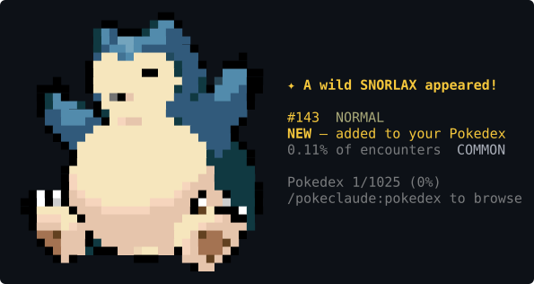
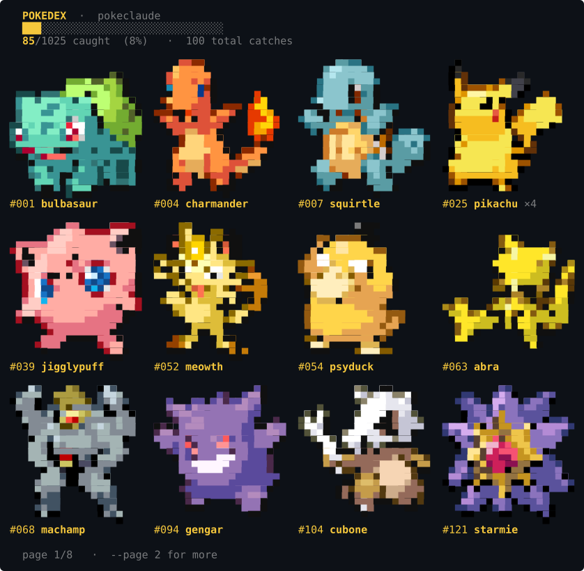
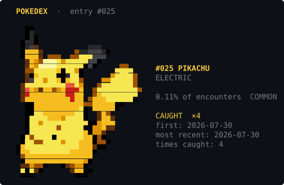
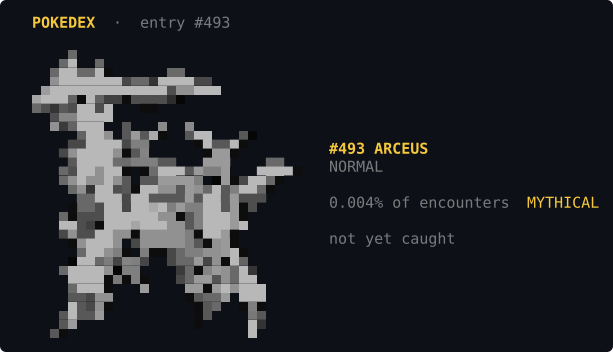

# PokeClaude

Catch Pokemon while you work. Every turn you spend tokens in your AI coding agent is a
chance at a wild encounter, rendered as truecolor pixel art directly in your terminal.



All 1025 Pokemon from Gen 1–9, with shiny variants. Your Pokedex is shared across **every**
session — parallel agents, every project, one collection.

**Works on Claude Code, Codex CLI and Kiro CLI**, and runs (with colour stripped) in the
Codex, Cursor and Kiro GUIs. See [Agent support](#agent-support) for the full list.

---

## Install

Requires Python 3 (system `python3` is fine, no packages) and a truecolor terminal.

Any agent with a plugin marketplace and a hooks system can run PokeClaude. Use its own
marketplace command where it has one; otherwise the bundled installer writes the hook
config directly. Replace `<you>/pokeclaude` with your repo, or a local path to a clone.

### Claude Code

```bash
claude plugin marketplace add <you>/pokeclaude
claude plugin install pokeclaude@pokeclaude
```

Adds `/pokeclaude:pokedex`, `/pokeclaude:pokeclaude`, `/pokeclaude:release`.

### Codex CLI

```bash
codex plugin marketplace add <you>/pokeclaude
codex plugin add pokeclaude@pokeclaude
```

Adds `/pokedex`, `/pokeclaude`, `/pokeclaude-release`.

### Kiro, Cursor, Copilot, and others without a marketplace

```bash
git clone https://github.com/<you>/pokeclaude.git
cd pokeclaude
python3 install.py --host kiro       # or cursor, or copilot
python3 install.py                   # or detect and install every agent found
```

Kiro also gets the `/pokedex`, `/pokeclaude`, `/pokeclaude-release` slash commands.

Restart the agent after installing so it loads the hooks. Then type `/` in its chat to see
the commands, or run `python3 plugin/scripts/pokedex.py` from anywhere.

---

## Agent support

**Working**

- Claude Code (CLI and plugin)
- Codex CLI
- Kiro (CLI)

**Partially working** — these GUIs collapse tool output and strip colour. Run
`python3 plugin/scripts/config.py --mono on` and art switches to shading silhouettes that
survive without colour.

- Codex (app / agent window)
- Cursor (agent panel)
- Kiro (IDE)

**Not tested**

- GitHub Copilot CLI

An adapter exists but has not been run against the real agent.
`python3 tools/check_host.py copilot` reports whether the hook fires and on which channel.

### Installing on another agent

```bash
git clone https://github.com/<you>/pokeclaude.git
cd pokeclaude

codex plugin marketplace add <you>/pokeclaude && codex plugin add pokeclaude@pokeclaude

python3 install.py --host kiro       # or cursor, or copilot
python3 install.py --list            # what is detected and installed
python3 install.py --dry-run         # preview without writing
python3 install.py --uninstall       # remove again
```

`install.py` merges into existing hook config rather than overwriting it, and backs the
original up to `<file>.pokeclaude-backup`. Restart the agent afterwards.

Kiro also gets slash commands (`/pokedex`, `/pokeclaude`, `/pokeclaude-release`) via Agent
Skills. Override agent detection with `POKECLAUDE_HOST=codex` if needed.

---

## Your Pokedex

Browse everything you have caught, in colour, with duplicate counts:

```bash
python3 plugin/scripts/pokedex.py
```

Or use the slash command: `/pokeclaude:pokedex` in Claude Code, `/pokedex` in Kiro.



`--id N` opens a single entry with its rarity, catch count and timestamps:



Species you have not caught render in greyscale:



### Options

| Flag | Effect |
|---|---|
| *(none)* | first page of caught Pokemon |
| `--page N` | a specific page |
| `--all` | include uncaught entries as dim silhouettes |
| `--id N` | large detail view for one species |
| `--shiny` | show only the shinies you have caught |
| `--normal` | with `--id`, the ordinary colours of a species you own a shiny of |
| `--stats` | progress summary, no art |
| `--dupes` | full duplicate list, most-caught first |
| `--project` | only Pokemon caught while working in this project |
| `--scale 1\|2\|3` | sprite size: 1 = 64px, 2 = 32px, 3 = 21px |
| `--mono` | solid silhouettes instead of colour, for hosts that strip ANSI |

`--id` accepts a dex number. Flags combine, e.g. `--project --stats` or `--shiny --project`.

---

## Shinies

Every catch has a **1 in 64** chance of being shiny — the alternate-coloured variant, with
its own real sprite.

The roll is independent of species, so a shiny Rattata and a shiny Mewtwo are equally
likely. Shinies are tracked separately from ordinary catches, so owning a normal Pikachu
*and* a shiny one records both.

- The grid marks them `✧` and renders them in their shiny colours
- `--id N` shows the shiny count and when you first got one
- `--shiny` filters your collection to just the shinies you own
- `--id N --normal` switches a species back to its ordinary colours

Shiny colours are **earned, not previewed**: the Pokedex will not show you a species' shiny
palette until you have caught one.

To look at shiny art outside the Pokedex (spoils nothing, reads no collection data):

```bash
python3 tools/preview_shiny.py 6          # charizard, normal vs shiny
python3 tools/preview_shiny.py pikachu    # by name
python3 tools/preview_shiny.py --random 5 # five random species
python3 tools/preview_shiny.py --scale 2 25
```

---

## Catch rate

```bash
python3 plugin/scripts/config.py           # show current setting
python3 plugin/scripts/config.py light     # 1 per 300k tokens  (~2 per session)
python3 plugin/scripts/config.py normal    # 1 per 600k tokens  (~1 per session, default)
python3 plugin/scripts/config.py strict    # 1 per 1.2M tokens  (~0.5 per session)
python3 plugin/scripts/config.py --tokens 900000   # an exact rate
```

Under Claude Code: `/pokeclaude:pokeclaude light`.

Only turn tokens count — input + output, never cache. Settings live in
`~/.claude/pokeclaude/config.json` and apply to every session and every agent.

## Art mode

For GUIs that strip colour (the Codex app, Cursor's panel, the Kiro IDE):

```bash
python3 plugin/scripts/config.py --mono on     # shading silhouettes, no colour needed
python3 plugin/scripts/config.py --mono off    # force colour
python3 plugin/scripts/config.py --mono auto    # decide per agent (default)
```

---

## Releasing

Deletes collection data, so it runs in two steps — without `--confirm` it shows what would
happen and changes nothing.

```bash
python3 plugin/scripts/release.py pikachu            # dry run
python3 plugin/scripts/release.py pikachu --confirm  # do it
python3 plugin/scripts/release.py all --confirm      # full reset
python3 plugin/scripts/release.py all --project --confirm  # this project only
```

Under Claude Code: `/pokeclaude:release`.

---

## Per-project Pokedex

`--project` scopes any view to the current repo (git toplevel, else the working directory),
so you can see how your luck has been on one codebase:

```bash
python3 plugin/scripts/pokedex.py --project --stats
```

The global collection stays the single source of truth; project counts are additive
bookkeeping on top.

---

## How it works

For the curious. Nothing here is needed to use it.

**Catch rolls.** A turn-end hook fires once per completed turn and rolls against that
turn's real assistant `output_tokens` — everything produced between your prompt and the end
of the response. Long turns improve your odds; short ones barely move the needle. Scope is
strictly one turn, so installing mid-session doesn't hand out a free catch.

```
p(catch) = min(0.25, turn_tokens / TOKENS_PER_CATCH)
```

The ceiling means one enormous turn is lucky rather than inevitable.

**Zero token cost.** The hook runs outside the model. On Claude Code it reports as
`harness-only — no model context cost`; verify with `claude plugin details pokeclaude`.

**Species selection.** Weighted by rarity, with legendaries and mythicals scarcer.
Duplicates are possible but kept at a quarter the weight of an unseen species, so the dex
fills in while still handing out repeats. Rarity tiers come from PokeAPI's own
`is_legendary` / `is_mythical` flags.

**Rendering.** Sprites are stored as a palette plus one character per pixel, and drawn with
the Unicode half-block `▀`: the glyph's foreground paints the upper pixel and its background
the lower one, giving two pixels per character cell. Adjacent pixels usually share a colour,
so escape sequences are only emitted on change.

**Storage.** One JSON file at `~/.claude/pokeclaude/pokedex.json`, written under an
`O_EXCL` lockfile via temp-file-and-rename, so parallel sessions cannot lose a catch or
leave a half-written file. A corrupt file is quarantined rather than overwritten.

**Non-interference.** The hook exits 0 and prints nothing on any failure — unreadable
transcript, missing sprite, unavailable lock. A dropped catch is invisible; a crashing hook
would break your session.

**Agent adapters.** Everything above is shared. Each agent differs in only two respects —
where the turn's token count lives, and how a hook can show you a banner — and those live in
`plugin/lib/pokeclaude/hosts.py`. See [`docs/HOSTS.md`](docs/HOSTS.md) to add another, and
for what is verified on each.

---

## Assets

Sprites are baked from [PokeAPI/sprites](https://github.com/PokeAPI/sprites) (official
96x96 art) into a compact palette+index format — ~4KB each, 4MB for all 1025, plus the same
again for shinies.

```bash
python3 tools/bake_sprites.py --max-dex 1025 --size 64
python3 tools/bake_sprites.py --max-dex 1025 --size 64 --shiny
python3 tools/bake_sprites.py --ids 25 --preview
```

Baking needs Pillow; the baked assets ship in the repo, so users never run this.

README images are generated from the scripts' real output, so they cannot drift from what
the code prints:

```bash
python3 tools/ansi_to_svg.py --demo catch --id 143 --out docs/catch-snorlax.svg
python3 tools/animate_demo.py --style ball --id 143 --out docs/anim-catch.gif
```

---

## Tests

```bash
python3 tests/test_pokeclaude.py     # the suite
python3 tools/check_host.py --all    # verify the hook under every agent adapter
```

`check_host.py` forces a catch with a synthetic turn and reports which channel the banner
came out on, so a host wiring problem is distinguishable from a plugin problem.

324 checks, no pytest needed. They isolate via `POKECLAUDE_HOME` and assert they never
touch a real Pokedex.

---

## License

MIT for the code. Sprite art derives from Nintendo/Game Freak's Pokemon and is
redistributed via PokeAPI; this is an unofficial fan project. See [LICENSE](LICENSE).
