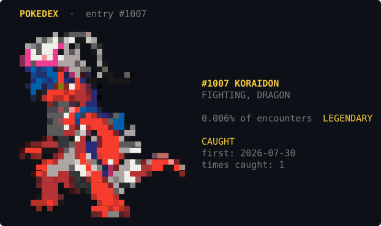

# PokeClaude

Catch Pokemon while you work. Every turn you spend tokens in Claude Code is a chance at
a wild encounter, rendered as truecolor pixel art directly in your terminal.


Your Pokedex is shared across **every** Claude Code instance — parallel sessions, every
project, one collection.

## Your Pokedex

`/pokeclaude:pokedex` pages through everything you have caught, in colour, with duplicate
counts:


`--id N` opens a single entry, with its encounter rarity and catch history. Species you have
not caught yet render in greyscale, so it is obvious at a glance what you actually own:





## Shinies

Every catch has a **1 in 64** chance of being shiny — the alternate-coloured variant, with
its own real sprite rather than a recolour filter.

The roll is independent of which species appeared, so shininess never compounds with
rarity: a shiny Rattata and a shiny Mewtwo are equally likely. That is deliberate. Were the
two multiplied, a shiny legendary would sit past a human lifetime of use.

1 in 64 is far more generous than the games' 1 in 8192, because catches here are themselves
rare — roughly one per session on `normal`. At the games' odds nobody would ever see one.

Shinies are tracked separately from ordinary catches, so owning a normal Pikachu *and* a
shiny one records both. The grid marks them with `✧`, renders them in their shiny colours,
and `--id N` shows the count and when you first got one. `--id N --shiny` previews any
species' shiny colours, caught or not.

## Install

```bash
claude plugin marketplace add kazumah1/pokeclaude
claude plugin install pokeclaude@pokeclaude
```

Then start a new session and run `/pokeclaude:pokedex` to browse your collection. Catches begin
appearing as you work.

Requires Python 3 (system `python3` is fine) and a truecolor terminal.

Claude Code reports the footprint as **~49 tokens always-on** and classifies the hook as
`harness-only — no model context cost`; check it yourself with
`claude plugin details pokeclaude`.

## How it works

**Catch rolls.** A `Stop` hook fires once per completed turn and rolls against that
turn's real assistant `output_tokens` — everything produced between your prompt and the
end of the response. Long grinding turns genuinely improve your odds; short ones barely
move the needle. Scope is strictly one turn: the session so far never counts, so
installing mid-session doesn't hand out a free catch.

**Odds.** `p(catch) = min(0.25, turn_tokens / TOKENS_PER_CATCH)` — linear in the turn's
tokens, ceilinged so one enormous turn is lucky rather than inevitable.

**Difficulty.** `/pokeclaude:pokeclaude light|normal|strict`:

| Preset | Rate | Catches per session |
|---|---|---|
| `light` | 1 per 300k tokens | ~2 |
| `normal` | 1 per 600k tokens | ~1 (default) |
| `strict` | 1 per 1.2M tokens | ~0.5 |

"Per session" is measured against a real 589k-token, 147-turn session, and that reference
is the point. Stating a rate as "1 per 100k tokens" sounds rare but means roughly **six**
catches in a session that size — the reason the default moved from 55k to 600k.

`--tokens N` sets an exact rate between or beyond the presets.

**Which tokens count.** Input + output, never cache. Measured over one session: 201M
cache_read against 309k output, a 664x ratio — counting cache would tie the rate to context
size rather than work done. `input_tokens` is included for correctness but caching leaves it
tiny (a 0.6% addition to output alone).

**Uncaught species render in greyscale.** Looking up something you do not own shows the
sprite desaturated to luminance rather than as a flat silhouette — the shading survives, so
it stays recognisable while clearly reading as unowned. Rec. 709 luma weights, because a
channel average maps red and blue to the same grey and loses the internal detail.

**Rarity.** Every catch and detail view shows the species' share of all encounters and its
tier — `0.011% of encounters · MYTHICAL` for Mew, `0.27% · COMMON` for Pikachu. Tiers cut on
the intrinsic rarity multiplier rather than share, so adding a generation does not
reclassify the dex: 365 COMMON, 16 LEGENDARY, 5 MYTHICAL.

**Rate.** Replaying 5,057 real turns from 157 sessions (30,330 active minutes) gives one
catch per **~72 minutes of active work** — about **1.5 catches in a median working
session**, with a ~80% chance of at least one. Both knobs live in
[`encounter.py`](plugin/lib/pokeclaude/encounter.py).

Real turns are much larger than intuition suggests — median 5,907 output tokens, p90
32,558, max 338,263 — so don't tune against an assumed "typical turn". Sessions are also
bimodal: a median of 2 turns across all 228 sessions, but 17 (p90 123) once you exclude
one-off questions.

The two knobs fight each other, which is worth knowing before turning either. Lowering
`MAX_TURN_PROBABILITY` to rein in long sessions barely works: 71% of the catches in a
marathon session come from *ordinary* turns, because those sessions are long by turn count
(median 107 turns) rather than turn size. Restoring the average afterwards by lowering
`TOKENS_PER_CATCH` pushes marathon totals right back up. Scale the whole curve with
`TOKENS_PER_CATCH`; use the cap only to bound extremes.

Three traps if you retune it, each of which produced a wrong constant here first:

1. Claude Code writes one transcript record per content block and repeats the message's
   *final* `output_tokens` on every one — naive per-record summing over-counts by 2–3x.
   Deduplicate by `message.id`.
2. "Tokens per minute" depends entirely on the denominator: wall-clock gives ~1,070
   tok/min, excluding idle gaps gives ~2,090. Prefer replaying turns.
3. Tool results are recorded as `type: "user"`. Treating them as turn boundaries splits
   one agentic turn into dozens.

**It costs you nothing.** The catch banner is delivered via a hook's `systemMessage`,
which Claude Code renders to the UI *without* injecting it into the model's context.
Measured: 24.5k tokens of banner content delivered across four catches produced a **+0**
change in input/cache tokens. Reading the transcript happens in a separate process, off
the model's context entirely. PokeClaude observes your token usage; it never adds to it.

**Duplicates.** Already-caught species stay possible but are deliberately rarer —
weighted at `DUPLICATE_WEIGHT` (0.25) of an unseen one. Early on almost every catch is
new; duplicates only dominate once the Pokedex is nearly full, so catches never dry up.

**Legendaries** carry their own rarity multipliers (Mewtwo is ~15x rarer than Pidgey).

## Commands

Plugin commands are namespaced, so tab-complete `/pokeclaude:` to see both.

| Command | What it does |
|---|---|
| `/pokeclaude:pokeclaude` | Show or set the catch rate (light/normal/strict) |
| `/pokeclaude:pokedex` | Paginated grid of everything you've caught |
| `…:pokedex --all` | Include uncaught entries in greyscale |
| `…:pokedex --id 25` | Large detail view for one species |
| `…:pokedex --stats` | Progress summary, no art |
| `…:pokedex --dupes` | Full duplicate list, most-caught first |
| `…:pokedex --project` | Only Pokemon caught while working in this project |
| `…:pokedex --scale 1` | Full 64px sprites (may be persisted, not inline) |
| `/pokeclaude:release <name>` | Release one Pokemon (dry-run first) |
| `…:release all` | Wipe the Pokedex and start over |

### Per-project Pokedex

`--project` scopes to the current repo (git toplevel, else the working directory), so you
can see how your luck has been on one project. Per-project counts are tracked
independently, not merely filtered — Pikachu can be ×4 globally while being ×3 here and
×1 somewhere else.

The global collection is always the source of truth. `--project` is a view over it, and
`…:release all --project` resets one project's records **without** touching your
real collection.

### Releasing

Releasing deletes collection data, so it is deliberately two-step: the command dry-runs
first, prints exactly what would be removed, and exits without changing anything until you
pass `--confirm`.

| Exit | Meaning |
|---|---|
| `0` | done, or nothing to do |
| `1` | unknown Pokemon, or lock unavailable (nothing changed) |
| `2` | dry run — awaiting `--confirm` |

## Rendering

Sprites are drawn with Unicode half-blocks (`▀`), where a glyph's foreground paints the
upper pixel and its background the lower one — two pixels per character cell, so a 64x64
sprite occupies 64 columns by 32 rows.

Stored at **64px with up to 63 colours**, which is as much as the source holds: the official
art is 96x96 but only ~78x41 pixels of it are actual content, so 64px keeps essentially all
real detail while 96px would be interpolation. Grid views downsample 3x (21px) and catch
banners 2x (32px) so they fit beside their text; column count comes from your real terminal
width, because wrapping destroys pixel art. 3x rather than 4x for the grid because it keeps
~20 distinct colours per sprite instead of 16, which is the difference between a readable
silhouette and a smear.

Escape codes are emitted only when a colour changes rather than per cell, which cuts the
byte overhead 3-5x — that matters because all art travels through a hook field.

**Output size matters.** ~88% of a rendered sprite is colour escapes, so a 64px sprite is
12-26KB depending on species — which straddles the threshold where Claude Code persists tool
output to a file and shows a 2KB preview instead, truncating the art mid-render. The detail
view therefore defaults to 32px (3.7-6.0KB, always inline) with `--scale 1` available for
full resolution. A simultaneous foreground+background change is also folded into a single
SGR sequence, which removes roughly 560 escapes per sprite.

**Why a hook renders the Pokedex.** Truecolour only survives on channels Claude Code paints
itself: a hook's `systemMessage` is one, but text the assistant writes into its reply is
content and gets its VT control characters stripped. So a `PostToolUse` hook re-emits the
script's stdout as a `systemMessage`. Without it the art arrived as monochrome blocks unless
you pressed ctrl+o to see the raw output.

## Storage

Everything lives in `~/.claude/pokeclaude/`:

```
pokedex.json        your collection
pokedex.json.lock   O_EXCL mutex
state.json          per-session roll bookkeeping
config.json         difficulty preset
```

Writes take a lockfile, re-read inside the lock, and swap in via atomic rename, so
parallel Claude sessions can't corrupt or clobber each other. Readers never block. A
corrupt file is quarantined as `.corrupt-<ts>` rather than overwritten.

Config via environment:

| Variable | Effect |
|---|---|
| `POKECLAUDE_DISABLE=1` | Turn off catching entirely |
| `POKECLAUDE_HOME` | Move the data directory (useful for testing) |
| `POKECLAUDE_WIDTH` | Override detected terminal width |

## Non-interference

The hook runs on every turn, so it is built to fail silently: unreadable transcript,
missing sprite, unavailable lock, malformed input — all exit 0 and print nothing. A
dropped catch is invisible. A crashing or hanging hook would ruin your session, so that
never happens.

One roll per turn. The hook records the id of the turn it last rolled for, so a `Stop`
that fires more than once (a subagent finishing, for example) cannot hand out several
chances for one prompt. Because scope is a single turn rather than a running byte offset,
there is nothing to drift, desync on a rewritten transcript, or accumulate — resuming,
forking and `/compact` all just start the next turn cleanly.

## Assets

Sprites are baked from [PokeAPI/sprites](https://github.com/PokeAPI/sprites) (official
96x96 art) into a compact palette+index format — ~4KB each, 4.0MB for all 1025, plus the
same again for the shiny variants.

```bash
python3 tools/bake_sprites.py --max-dex 1025 --size 64
python3 tools/bake_sprites.py --max-dex 1025 --size 64 --shiny   # shiny variants
python3 tools/bake_sprites.py --ids 25 --preview   # see one in your terminal
```

Baking crops to the content bbox before downscaling (otherwise a third of the pixel
budget encodes empty margin), thresholds alpha *before* resizing to keep silhouettes
crisp, quantizes to <=63 colours (one symbol per pixel from a 64-character alphabet), and
trims blank rows so a wide sprite does not store half a file of padding.

Every generation's art turned out to be the same 96x96, 10–15 colour format, so gens 4–9
needed no pipeline changes — only a longer id range.

Species names come from PokeAPI too, with default-form suffixes stripped: it labels the
only form we bake as `deoxys-normal` and `squawkabilly-green-plumage`, the latter being 26
characters and wider than a grid cell. The strip is a denylist of known suffixes rather
than "cut at the first hyphen", because 39 species have a load-bearing hyphen — that naive
rule would leave `iron-treads` as "iron" and `ho-oh` as "ho".

Pokemon is a trademark of Nintendo / Creatures Inc. / GAME FREAK Inc. This is an
unofficial fan project.
